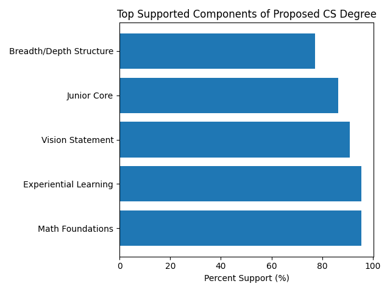
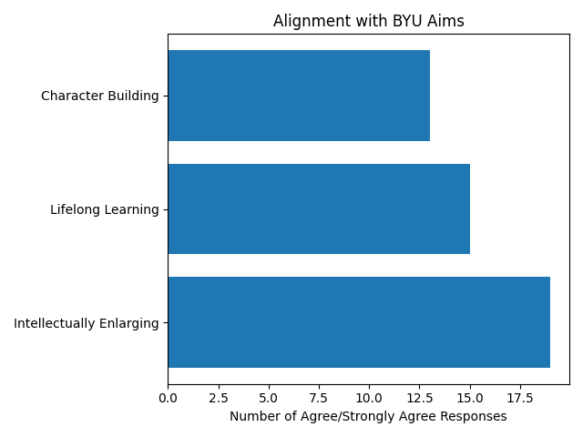

# Top 8 Strengths (Based on Survey Support)

This document lists the areas of the proposed CS degree that received the **strongest support**, ordered by survey results (highest approval first).

---

## Visual Summary

### Top Supported Components

### Alignment with BYU Aims

---

## 1. Math Foundations
- 21 support, 1 do not support
- Strongest overall consensus
- Seen as essential for intellectual development

---

## 2. Experiential Learning Requirement
- 21 support, 1 do not support
- Strong agreement on value for real-world preparation and career readiness

---

## 3. Vision Statement
- 20 support, 2 do not support
- Broad alignment with overall direction of the degree

---

## 4. Junior Core
- 19 support, 3 do not support
- Strong support for structured core experience

---

## 5. Breadth/Depth Elective Structure
- 17 support, 5 do not support
- Majority support for the idea of combining breadth and depth

---

## 6. Intellectual Enrichment Alignment
- Consistently high agreement across all areas
- Most respondents agreed the curriculum is intellectually enlarging

---

## 7. Lifelong Learning Alignment
- Generally positive responses across all components
- Moderate-to-strong agreement overall

---

## 8. Experiential Learning for Character Development
- Strong agreement that experiential learning supports character building

---

## Summary

The strongest areas of support emphasize:
- Foundational rigor (math)
- Real-world preparation (experiential learning)
- Overall vision and structure of the degree

These results indicate strong alignment with intellectual development and practical readiness.
